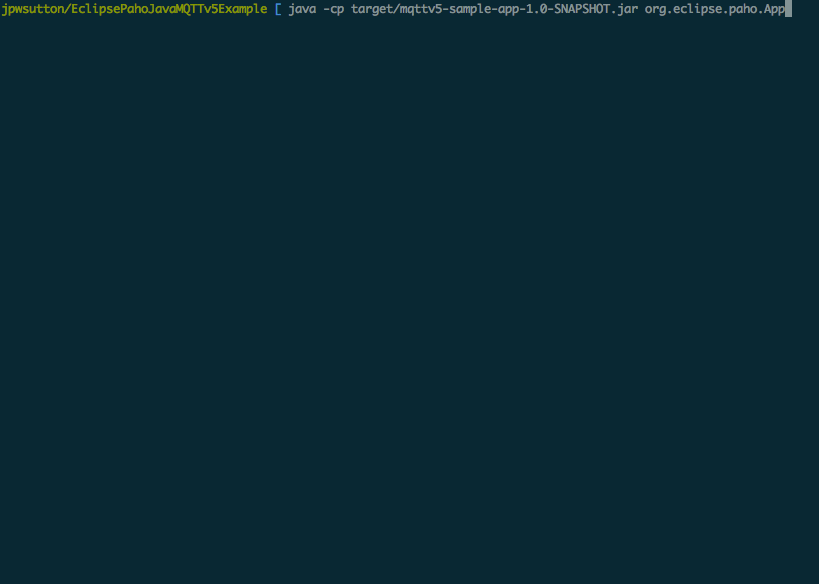

# EclipsePahoJavaMQTTv5Example
An Example MQTTv5 Application using the new Eclipse Paho Java Client



## Build and Run

 * To build: ```mvn package```
 * Then to run it: ```java -cp target/mqttv5-sample-app-1.0-SNAPSHOT.jar org.eclipse.paho.App```


## Finding an MQTTv5 Broker to test against

This client has so far been tested agains the Eclipse Paho Interoperability v5 Broker written by [Ian Craggs](https://github.com/icraggs) and can be found in the following repository: https://github.com/eclipse/paho.mqtt.testing.

To run, simply enter the interoperability directory and run ```python3 startbroker5.py```.


## Features so far:

 - Packet Serialisation / Deserialisation for all MQTTv5 Packets as of the last Working Draft Spec with test suite
 - Connect Options have been expanded to include new properties
 - CONNACK properties can be returned and inspected.
 - SUBACK properties can be returned and inspected.
 - Topic Aliases "Should" be implemented, but have not fully tested yet.
 - New disconnected callback replacing connectionLost. However not fully implemented.
 - Numerous other small changes to the API here and there.


## Help, something doesn't work! / This looks terrible! / What about x!

The [Paho Java Client](https://github.com/eclipse/paho.mqtt.java/tree/mqttv5-new) is under active development and as such may be incomplete / broken a lot of the time right now. However, the more feedback and help we get on it, the better it will get! If you have any issues, please raise a bug against the client [here](https://github.com/eclipse/paho.mqtt.java/issues), but **please** prefix it with 'MQTTv5' so we know that it's not an issue with the current v3.1.1 client.

If you have any ideas about how the API should be designed going forward, then please chip in on [this](https://github.com/eclipse/paho.mqtt.java/issues/389) issue.

And of course, if you think of an amazing new feature for the v5 client, have a go at implementing it and submit a pr against the mqttv5-new branch!
